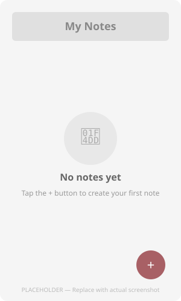
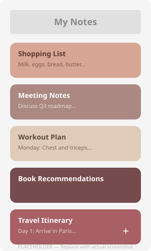
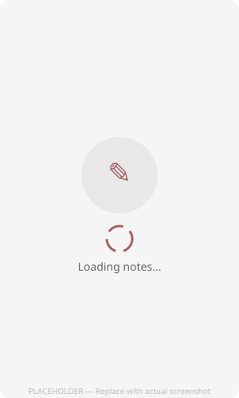

# NotesApp

A clean, modern Android notes application built with Kotlin and Jetpack Compose. The app features a warm **Copper Rose** color palette, an MVVM architecture, and local persistence using Room Database.

Users can quickly create, view, edit, and delete notes — all stored locally on the device.

---

## Project Overview

NotesApp is a lightweight note-taking app designed with a focus on simplicity and a pleasant visual experience. The interface uses a custom warm-toned color scheme (Copper Rose, Dusty Rose, Rosewater, China Doll, Plum Wine) applied across note cards, giving each note a distinct look. The architecture follows Google's recommended patterns with a clear separation between UI, business logic, and data layers.

---

## Features

- **View all notes** — Notes are displayed in a scrollable list with color-coded cards
- **Empty state** — A friendly message and icon are shown when no notes exist
- **Add a new note** — Tap the floating action button to create a note with a title and content
- **Edit an existing note** — Tap any note card to modify its title or content
- **Delete notes** — Each note card has a delete button for quick removal
- **Form validation** — The title field is required; an error is shown if left blank
- **Loading indicator** — A spinner is displayed while notes are being loaded
- **Material 3 design** — Full compliance with Material Design 3 using Compose

---

## Tech Stack

| Technology | Purpose |
|---|---|
| **Kotlin** | Primary language |
| **Jetpack Compose** | Declarative UI framework |
| **Material 3** | Design system and component library |
| **Room Database** | Local SQLite persistence |
| **KSP** | Annotation processing for Room |
| **MVVM** | Architecture pattern (ViewModel + UiState) |
| **Coroutines + Flow/StateFlow** | Asynchronous data streams |
| **Navigation Compose** | Screen-to-screen navigation |
| **ViewModel + SavedStateHandle** | Lifecycle-aware state management |

---

## Architecture

The project follows the **MVVM (Model-View-ViewModel)** pattern with a **Repository** layer:

```
com.example.notesapp/
├── data/
│   ├── local/
│   │   ├── NoteEntity.kt
│   │   ├── NoteDao.kt
│   │   └── NotesDatabase.kt
│   └── repository/
│       ├── NotesRepository.kt
│       └── NotesRepositoryImpl.kt
├── navigation/
│   └── AppNavigation.kt
├── ui/
│   ├── addeditnote/
│   │   ├── AddEditNoteScreen.kt
│   │   ├── AddEditNoteUiState.kt
│   │   └── AddEditNoteViewModel.kt
│   ├── notes/
│   │   ├── NotesListScreen.kt
│   │   ├── NotesListUiState.kt
│   │   └── NotesListViewModel.kt
│   └── theme/
│       ├── Color.kt
│       ├── Theme.kt
│       └── Type.kt
├── NotesApplication.kt
└── MainActivity.kt
```

**Data flow:** `Room DAO → Repository → ViewModel (StateFlow) → Composable Screen (collectAsStateWithLifecycle)`

---

## Screenshots

> **Note:** The images below are placeholders. Replace them with actual application screenshots.

### 1. Empty Notes Screen

The main notes screen when no notes have been created yet. A sticky note icon and a prompt guide the user to tap the `+` button to create their first note.



### 2. Notes List

The main notes screen displaying multiple notes as color-coded cards. Each card shows the note title, a content preview, and a delete button. Cards cycle through six palette colors for visual variety.



### 3. Add Note

The screen used to create a new note. Contains a title field (required), a content field, and a checkmark FAB to save. The title field validates that it is not empty before saving.


### 4. Edit Note

The screen used to edit an existing note. The same form is pre-populated with the note's current title and content. The back arrow navigates to the notes list after saving.


### 5. App Icon / Loading

The loading screen displayed while notes are being fetched from the database. Shows a centered circular progress indicator in the Copper Rose accent color.



---

## Project Structure

```
NotesApp/
├── app/
│   ├── build.gradle.kts
│   ├── proguard-rules.pro
│   └── src/
│       ├── main/
│       │   ├── AndroidManifest.xml
│       │   ├── java/com/example/notesapp/
│       │   │   ├── data/local/
│       │   │   ├── data/repository/
│       │   │   ├── navigation/
│       │   │   ├── ui/addeditnote/
│       │   │   ├── ui/notes/
│       │   │   ├── ui/theme/
│       │   │   ├── MainActivity.kt
│       │   │   └── NotesApplication.kt
│       │   └── res/
│       ├── test/
│       └── androidTest/

```

---

## Future Improvements

- Search/filter notes by title or content
- Sort notes by creation date or last modified
- Add note categories or tags
- Rich text editing support
- Dark mode / theme toggle
- Cloud sync with Firebase or similar backend
- Note archiving instead of permanent deletion
- Swipe-to-delete with undo snackbar
- Widget for quick note creation from the home screen

---

## Getting Started

1. Clone the repository:
   ```bash
   git clone https://github.com/AyaSheta13/NotesApp.git
   ```
2. Open the project in Android Studio.
3. Sync Gradle and build the project.
4. Run on an emulator or physical device (minimum SDK 24).

---

## License

This project is open source. Add a license file if you wish to specify terms.
